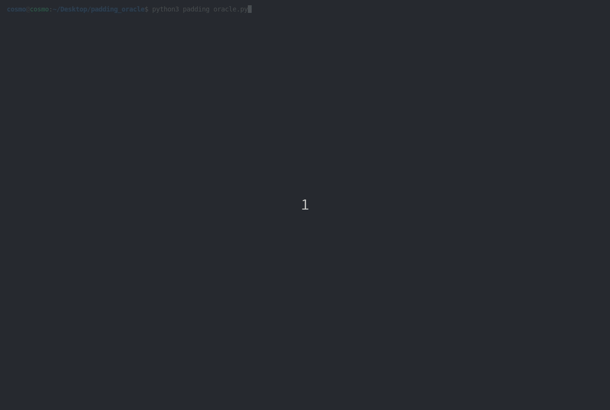

# padding_oracle_attack
A demo to showcase how a padding oracle attack works (e.g.  a side-channel that conveys information about the padding state)

## Usage
```
cosmo@cosmo:~/Desktop/python/padding_oracle$ python3 padding_oracle.py
```
## Demo

